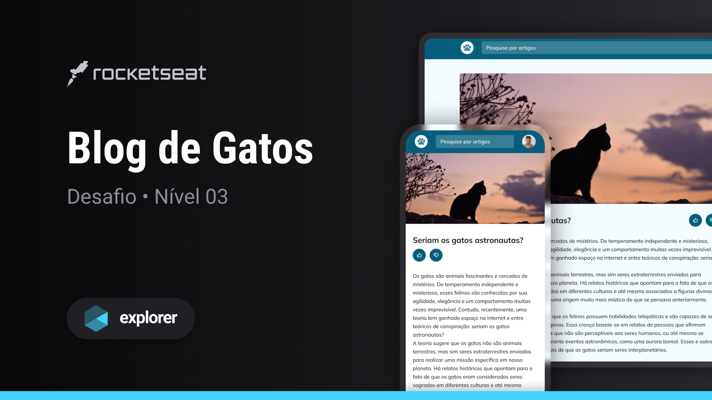

<h1 align="center"> Blog de Gatos </h1>

  <a href="#-tecnologias">Tecnologias</a>&nbsp;&nbsp;&nbsp;|&nbsp;&nbsp;&nbsp;
  <a href="#-projeto">Projeto</a>&nbsp;&nbsp;&nbsp;|&nbsp;&nbsp;&nbsp;
  <a href="#-layout">Layout</a>&nbsp;&nbsp;&nbsp;|&nbsp;&nbsp;&nbsp;
  <a href="#memo-licença">Licença</a>

  

 

  

 

## 🚀 Tecnologias

Esse projeto foi desenvolvido com as seguintes tecnologias:

- HTML e CSS
- Git e Github
- Figma

## 💻 Projeto

Página para um blog relacionado a gatos.

## 🔖 Layout

Você pode visualizar o layout do projeto através desse [link](https://www.figma.com/community/file/1256354927622258124).

## :memo: Licença

Esse projeto está sob a licença MIT.

---

Projeto feito em um desafio da Rocketseat.  :wave: [Participe da nossa comunidade!](https://discord.gg/rocketseat)
